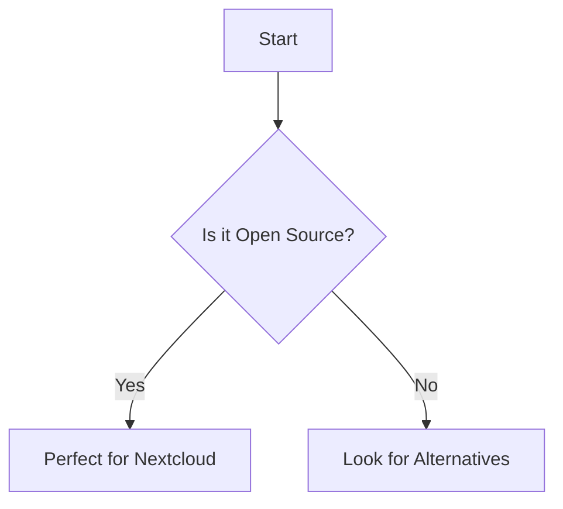

# Notebooks Folder

This folder contains Jupyter notebooks organized by their purpose, including EDA, feature engineering, modeling, and evaluation.

## Folder Structure
- `exploratory_data_analysis/`: Notebooks focused on understanding and visualizing raw data.
- `feature_engineering/`: Processes to create features from raw data.
- `modeling/`: Experiments with different model architectures, hyperparameters, and validation.
- `evaluation/`: Analyzes model performance and compares different models.
- `production/`: Notebooks for documenting production-ready models and their workflows.
- `reports/`: Generates analytical reports with findings and recommendations.
- `templates/`: Standardized templates to ensure consistency across notebooks.

## Best Practices
- **Naming Convention**: Name notebooks descriptively (e.g., `eda_initial_data_analysis.ipynb`).
- **Consistency**: Use templates from `templates/` to ensure uniformity across notebooks.

